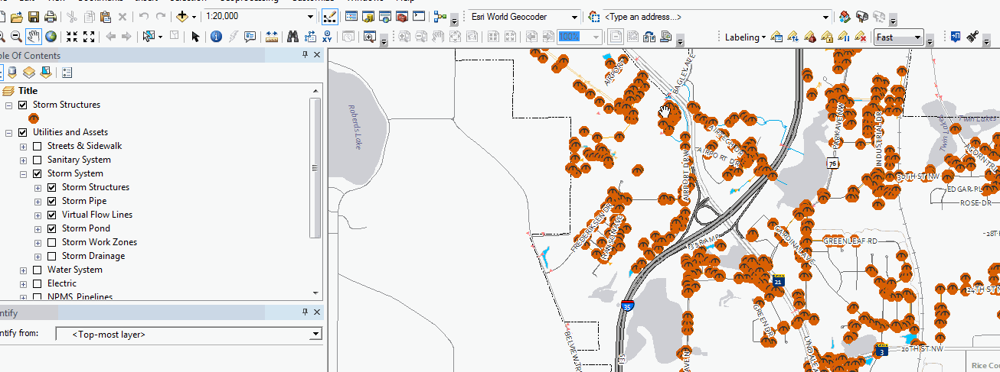
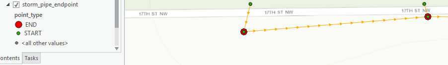

# ArcGIS Desktop Python Tools

A collection of custom Esri toolboxes written in python.

## Add-ins

Python add-ins for ArcMap.

## Definition Query

Quickly apply a definition query to selected layers using selected feature object id's

### Installation

1. Install the .addin file
2. Open ArcMap and add the toolbar "Faribault"

### Usage

1. Select some features
2. Select the layer in the TOC
3. Apply the definition query using the filter button

## Utilities toolbox

ArcGIS Utilities

### Generate Site Maps and CSV

A custom data driven pages tool used for a variety of purposes.

- Optionally buffers selected feature or features
- Selects features that intersect the buffer
- Exports map of all features
- Optionally exports individual data driven pages for each feature
- Exports a csv file with the selected features

### Clip geodatabase

This tool clips each layer in a geodatabase and projects the data into an output database using a specified projection file.

### Reproject geodatabase

Reprojects an entire geodatabase using a specified projection file. Layers not in a dataset will be placed in a `_top` dataset.

### Polygon Centroid Tool

- Copies a polygon feature class's centroid geometry into a new feature class
- Adds field `Rel_OID` type `Long` which represents the object id of the polygon

### Line Endpoint Tool

- Copies the start and endpoint of lines into a new feature class
- Adds field `related_oid` type `Long` which represents the object id of the line feature
- Adds field `point_type` type `Text` which will either be value `START` or `END`
- See <http://pro.arcgis.com/en/pro-app/arcpy/classes/geometry.htm>

### Point Elevation Tool

- Extracts elevation values at points and calculates them to a field
- This may crash ArcMap with large data sets

### Extract attachments tool

- Extracts attachments from a table and generates a unique file name for each file
- Adds a new field to the table called `file_name` that is updated to the file's unique name
- Requires fields `'DATA', 'ATT_NAME', 'ATTACHMENTID'`

## Scripts

### Update MXD Metadata

`scripts/UpdateMXDMetadata.py`

**Description:** Iterates through an mxd's layers and extracts data source metadata. Layer descriptions are updated to the latest abstract, purpose, and credits.

Each metadata category is separated into a separate html paragraph using `

` tags.

**Purpose:** Useful to update metadata on an arcgis server rest endpoint, because html paragraphs are formatted on the rest endpoint and in JSON responses.

**Usage:**

Run the script inside an arcmap python console that you want to update.

### Label Related Records

`scripts/LabelRelatedRecords.py`

**Description:** Looks up related records and generates a label with selected field in a list-like format.

**Usage:** See documented script

### Calculate Dynamic Expression Related Records

**Description:** Calculates the dynamic expression for a layer and can be used to dynamically display related records text for data driven pages or feature labels

**Usage (see script for detail)**

- Change the FindLabel parameter to the id field of the main table
- This id should be related to each of the related tables
- Also change the first line of FindLabel. Set parameter equal to the FindLabel parameter
- Change the lookup tables and assign their appropriate formatter function
